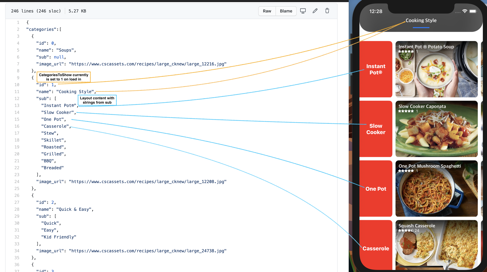
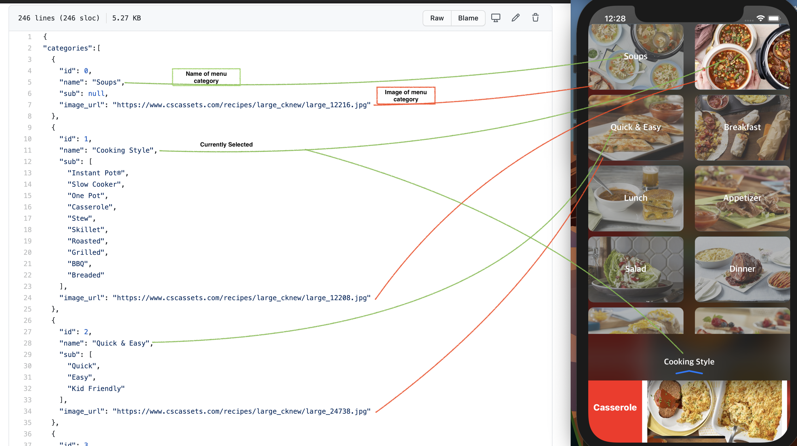
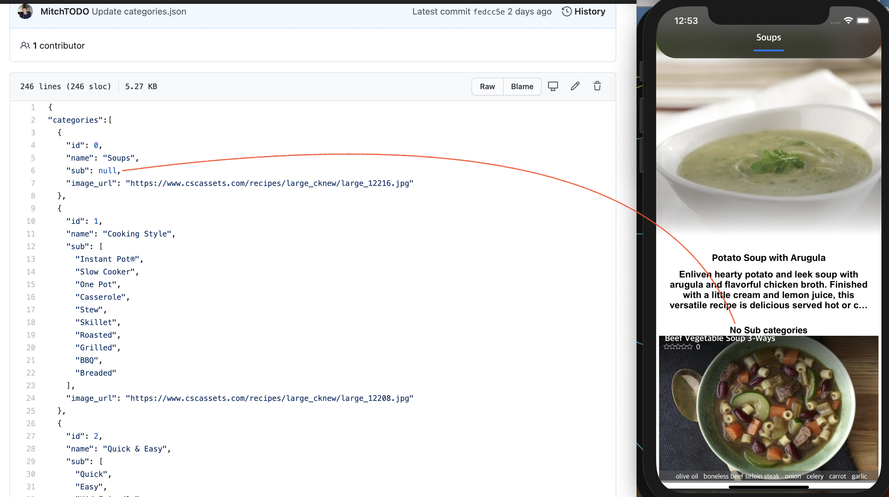

[]()
[]()


#  SimpleJSON 


## 📑 About

As JSON is mainly used between a browser and server, its also a good and simple solutuion to managing content within mobile app (Android & iOS).

This file can be referenced or used for examples.

What you will find.
- Quick json run down
- Using json to displayed content in a mobile app.


## 🏃🏽‍♂️ Quick Run down

Json code can be found in `Categories.json`.

One really nice thing about json it is really easy to understand. Below is a code snippet from the full json file.

Its best to build a Json schema in a way that can be easy expanded and updated without effecting the way its parsed. With the example below a list is used  (`categories`)  for felixablity with amount of menu objects that can be added or removed. Also by using optional values `null` allows for some felixability but will need to be handled when parsed. When it comes to best pratice having a integerty checking incorprated is crucial. Therefore I use a [MD5 hash](https://en.wikipedia.org/wiki/MD5) of the file to check for unwanted or accidentally changes. More info on integerty checking can be found  [here](https://stackoverflow.com/questions/30610545/checking-json-file-integrity) . Parsing json is common between languages but matching data structures and syntexs can be a little tricky. [Here](https://quicktype.io/) is a great online tool that matches json to different code structures.

    categories :    List of menu objects
    
                    Menu Object :       id:Integer        - Id of the selected menu object
                                        name:String       - Name of menu object
                                        sub:Array         - Optional subcategorie list of strings 
                                        image_url:String  - Url of a image 


    categoriesToShow:Integer  - Used for default menu object, by id 
    catId:String              - Used for integerty checksum (MD5 hash of the file)


```
{
    "categories":[
          {
            "id": 0,
            "name": "Soups",
            "sub": null,
            "image_url": "https://www.cscassets.com/recipes/large_cknew/large_12216.jpg"
          },
          {
            "id": 1,
            "name": "Cooking Style",
            "sub": [
              "Instant Pot®",
              "Slow Cooker",
              "One Pot",
              "Casserole",
              "Stew",
              "Skillet",
              "Roasted",
              "Grilled",
              "BBQ",
              "Breaded"
            ],
            "image_url": "https://www.cscassets.com/recipes/large_cknew/large_12208.jpg"
          },
      ],
      "categoriesToShow": 1,
      "catId":"adee68c3e030d723664bbbcfa12908de"
  }
```
## 📱Manage Content

The file is used to manage content with my ClassicRecipes app on both iOS and Android.

Below are images showing how I used the json to determine the layout of the user interface and the content it displays. Check out my design behind the user interface in this [repo](https://github.com/MitchTODO/Recipes).






Check out the ClassicRecipes app for yourself.

iOS
https://apps.apple.com/us/app/classic-recipes/id1544630699

Scan with camera 


Android 
https://play.google.com/store/apps/details?id=com.mitchelltucker.classicRecipes


## ❗️Issues  

If you feel that I left some thing out or want more code examples open a new issue for this repo. 


